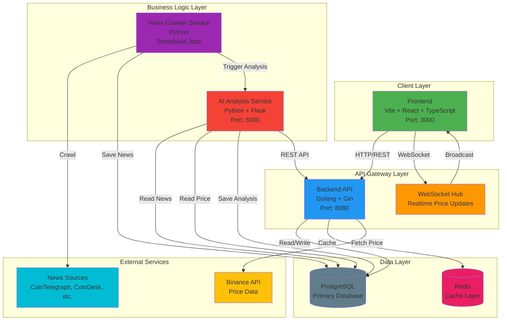
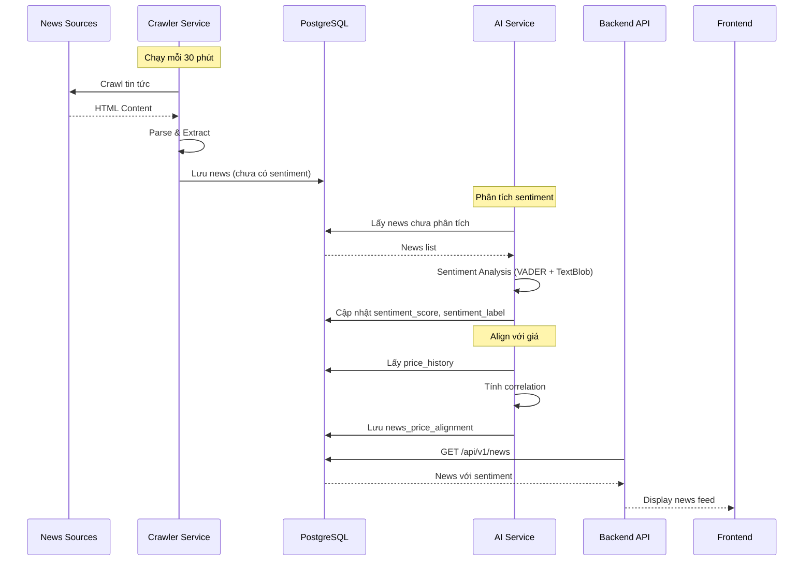
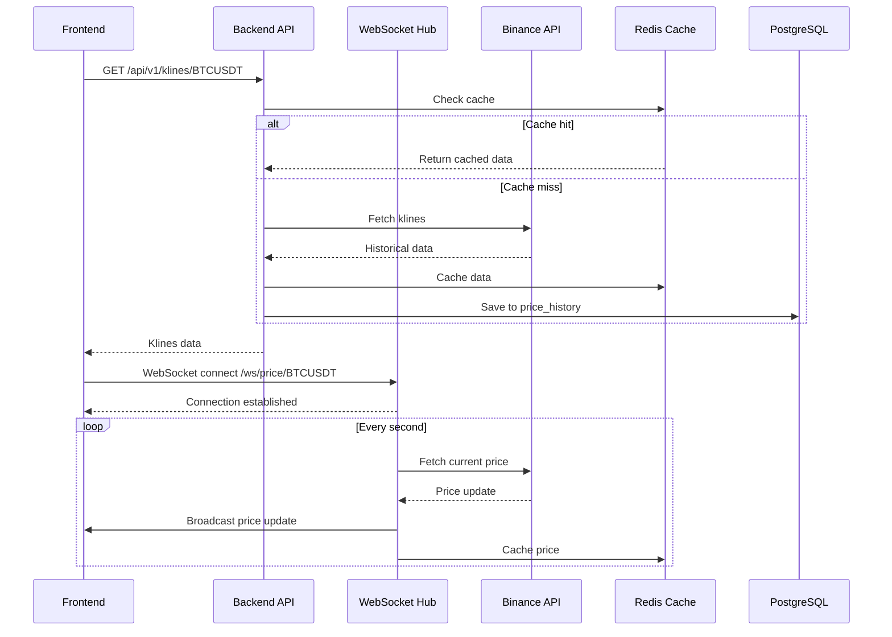
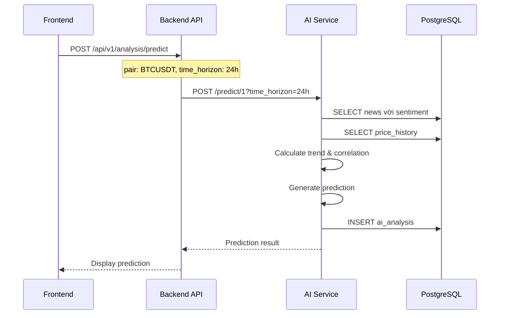
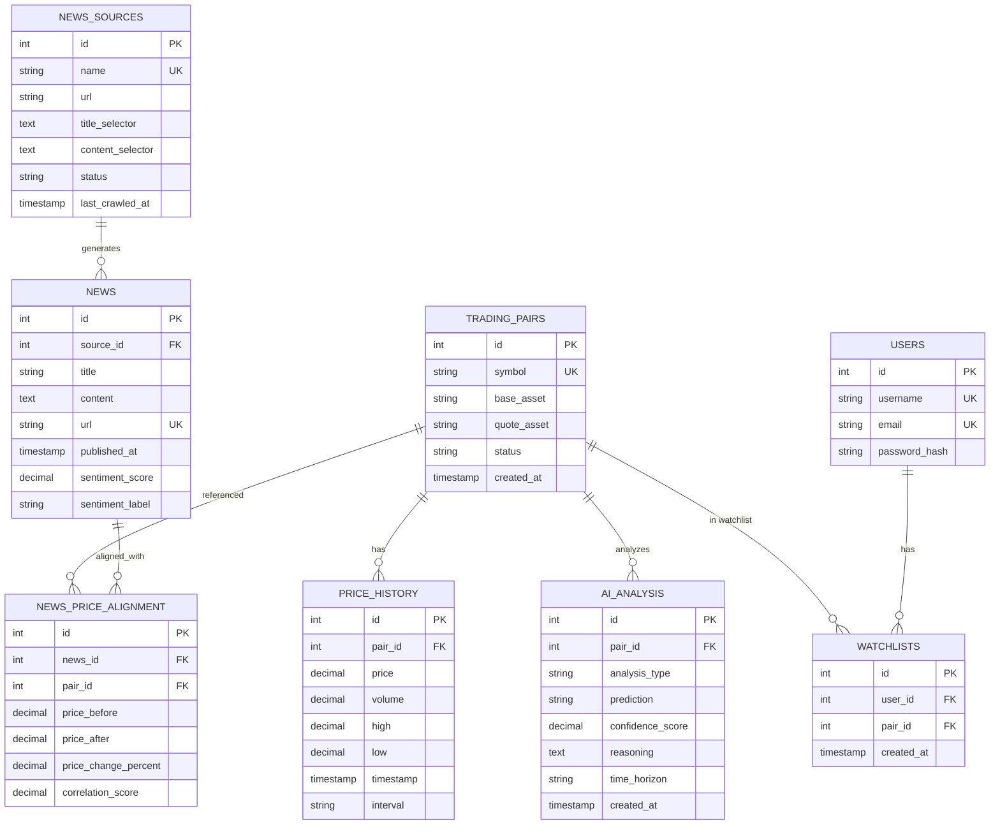
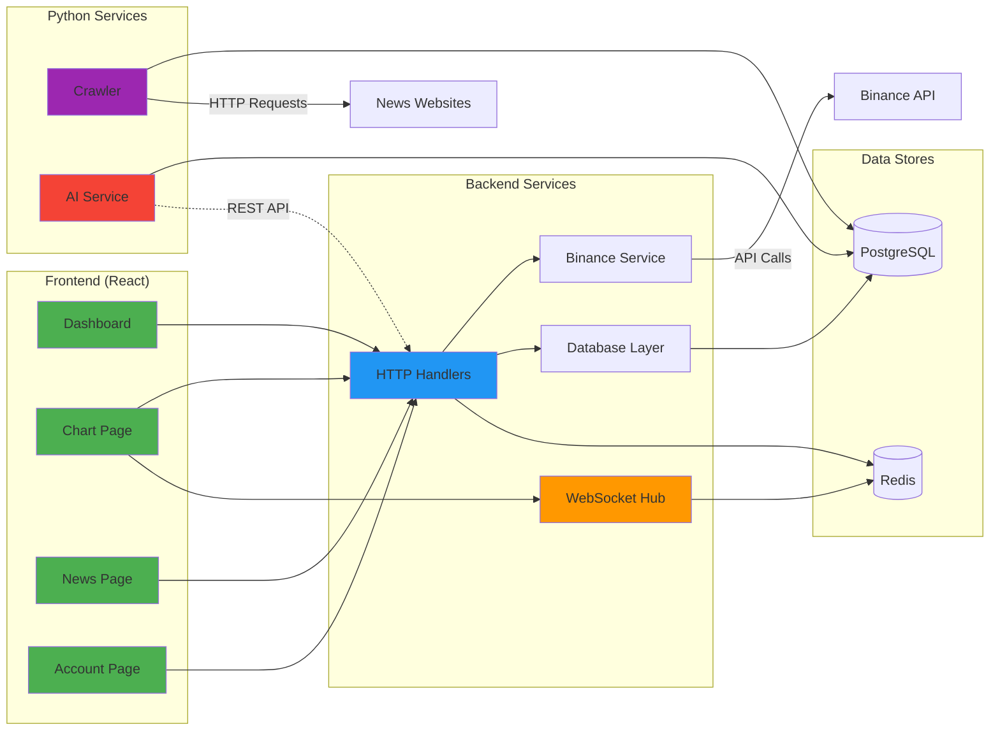
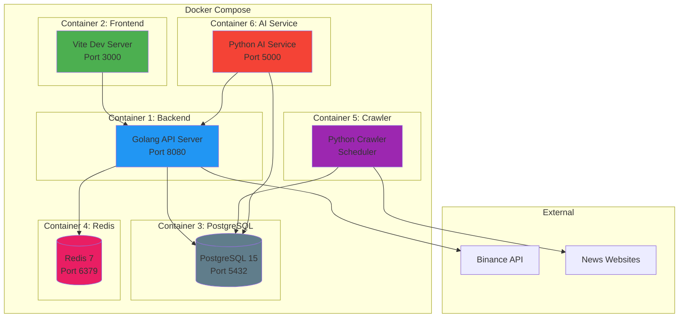
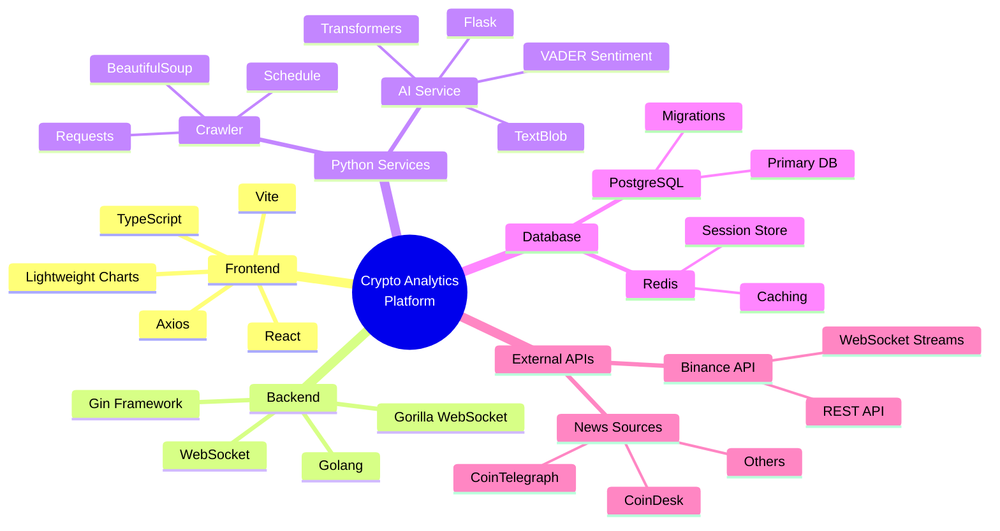
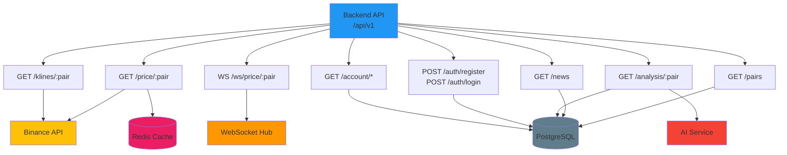
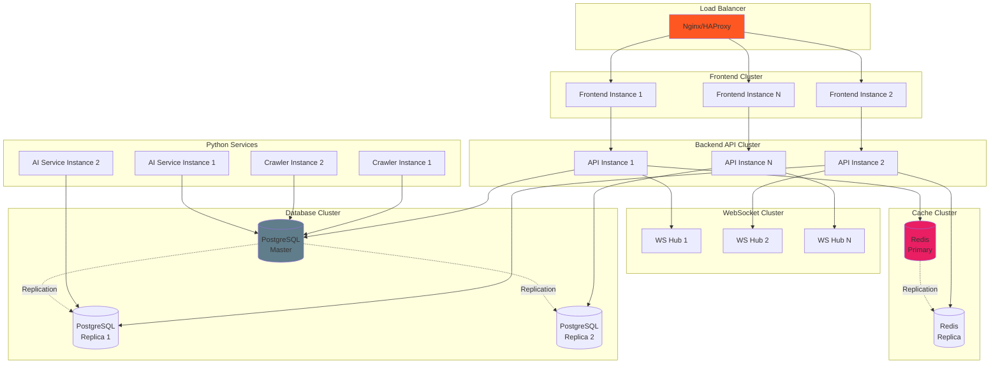

# Kiến trúc Hệ thống - Crypto Analytics Platform

## Sơ đồ kiến trúc tổng quan

## Luồng dữ liệu chi tiết

### 1. Luồng thu thập và phân tích tin tức

### 2. Luồng hiển thị giá realtime

### 3. Luồng phân tích và dự đoán AI

## Kiến trúc Database Schema

## Component Interaction Diagram

## Deployment Architecture

## Technology Stack

## API Endpoints Map

## Scalability Architecture

