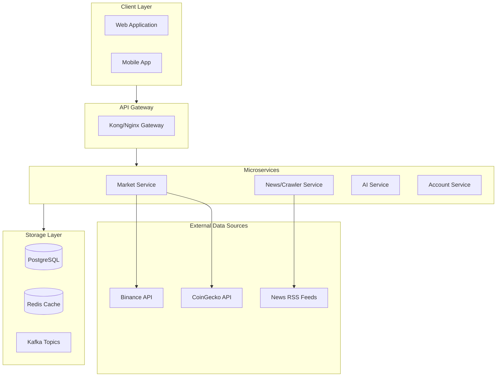
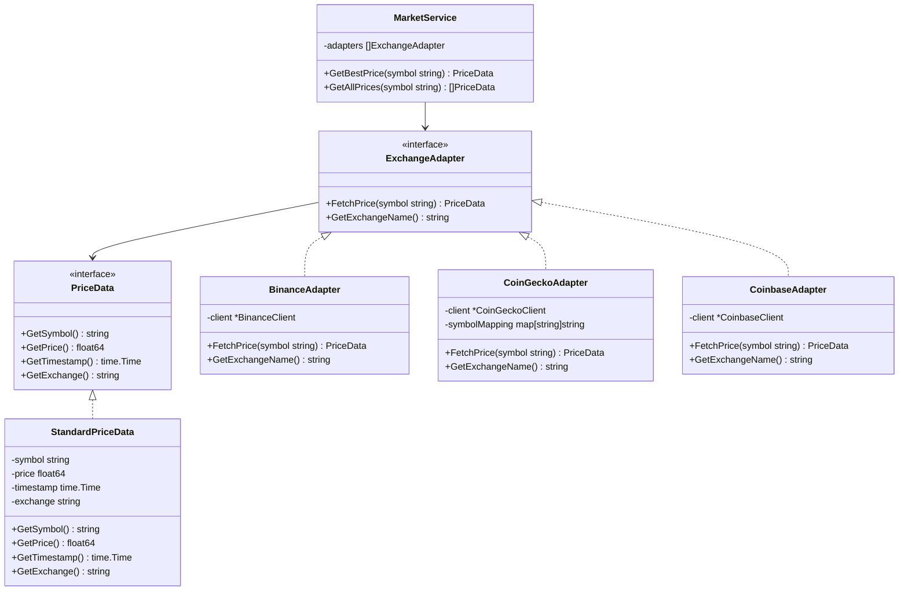
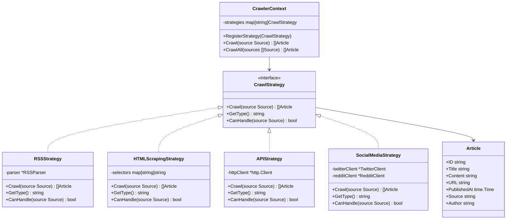
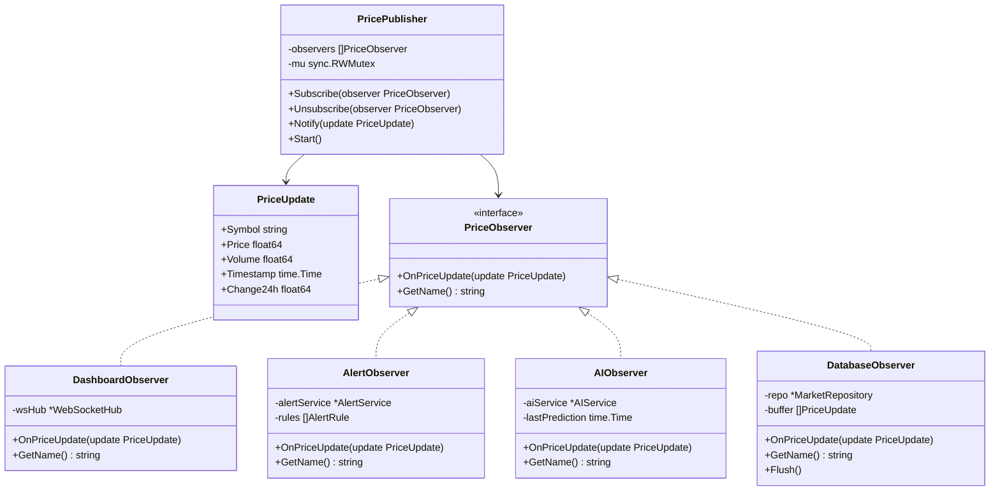
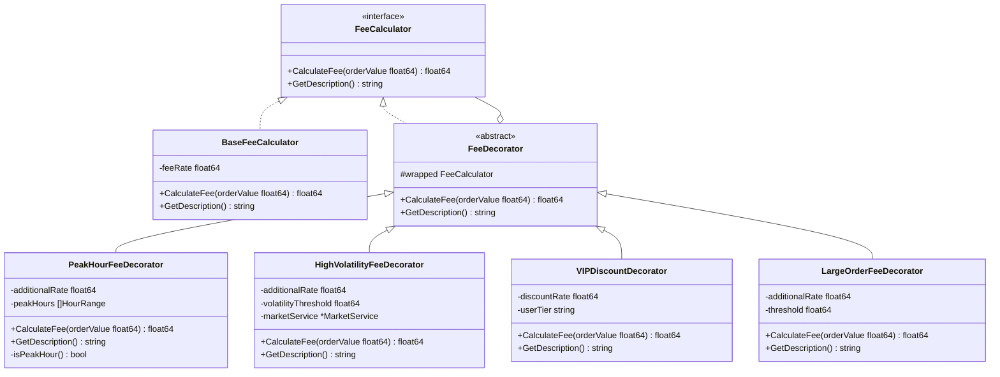

# BÀI TẬP THIẾT KẾ HỆ THỐNG CRYPTO ANALYTICS PLATFORM
# Áp dụng Design Patterns

**Họ và tên:** ___________________  
**MSSV:** ___________________

---

## 1. TỔNG QUAN

Thiết kế hệ thống backend **Crypto Analytics Platform** - hệ thống phân tích thị trường tiền điện tử với các chức năng:
- Lấy dữ liệu giá realtime từ nhiều sàn giao dịch
- Crawl tin tức từ nhiều nguồn
- Phân tích sentiment và dự đoán xu hướng bằng AI
- Quản lý tài khoản và cảnh báo người dùng

Áp dụng các **Creational, Structural và Behavioral Design Patterns** để giải quyết các vấn đề thiết kế.

---

## 2. SƠ ĐỒ KIẾN TRÚC TỔNG QUAN



---

## 3. BÀI TẬP VÀ LỜI GIẢI

### Bài 1: Multi-Exchange Data Adapter (ADAPTER PATTERN)

#### Vấn đề
Market Service cần lấy dữ liệu giá từ nhiều sàn giao dịch:
- **Binance API:** trả về `{"symbol": "BTCUSDT", "price": "45000.50", "timestamp": 1706000000}`
- **CoinGecko API:** trả về `{"id": "bitcoin", "current_price": 45000.50, "last_updated": "2024-01-23T10:00:00Z"}`
- **Coinbase API:** trả về `{"base": "BTC", "currency": "USD", "amount": "45000.50"}`

Mỗi API có format khác nhau, cần chuẩn hóa để sử dụng trong hệ thống.

#### Giải pháp: Sử dụng ADAPTER Pattern

**Lý do:**
- Adapter chuyển đổi interface không tương thích thành interface chuẩn
- Cho phép thêm sàn mới mà không sửa code hiện có
- Tuân thủ Open/Closed Principle

#### Sơ đồ UML



#### Code Implementation

```go
package market

import (
    "time"
)

// PriceData - Interface chuẩn cho dữ liệu giá
type PriceData interface {
    GetSymbol() string
    GetPrice() float64
    GetTimestamp() time.Time
    GetExchange() string
}

// StandardPriceData - Implementation chuẩn
type StandardPriceData struct {
    symbol    string
    price     float64
    timestamp time.Time
    exchange  string
}

func (s *StandardPriceData) GetSymbol() string     { return s.symbol }
func (s *StandardPriceData) GetPrice() float64     { return s.price }
func (s *StandardPriceData) GetTimestamp() time.Time { return s.timestamp }
func (s *StandardPriceData) GetExchange() string   { return s.exchange }

// ExchangeAdapter - Interface cho adapter
type ExchangeAdapter interface {
    FetchPrice(symbol string) (PriceData, error)
    GetExchangeName() string
}

// BinanceAdapter - Adapter cho Binance
type BinanceAdapter struct {
    client *BinanceClient
}

func NewBinanceAdapter(apiKey, apiSecret string) *BinanceAdapter {
    return &BinanceAdapter{
        client: NewBinanceClient(apiKey, apiSecret),
    }
}

func (b *BinanceAdapter) FetchPrice(symbol string) (PriceData, error) {
    // Binance trả về: {"symbol": "BTCUSDT", "price": "45000.50", "timestamp": 1706000000}
    response, err := b.client.GetTicker(symbol)
    if err != nil {
        return nil, err
    }
    
    return &StandardPriceData{
        symbol:    response.Symbol,
        price:     parseFloat(response.Price),
        timestamp: time.Unix(response.Timestamp/1000, 0),
        exchange:  "Binance",
    }, nil
}

func (b *BinanceAdapter) GetExchangeName() string {
    return "Binance"
}

// CoinGeckoAdapter - Adapter cho CoinGecko  
type CoinGeckoAdapter struct {
    client        *CoinGeckoClient
    symbolMapping map[string]string // BTCUSDT -> bitcoin
}

func NewCoinGeckoAdapter() *CoinGeckoAdapter {
    return &CoinGeckoAdapter{
        client: NewCoinGeckoClient(),
        symbolMapping: map[string]string{
            "BTCUSDT": "bitcoin",
            "ETHUSDT": "ethereum",
            "BNBUSDT": "binancecoin",
        },
    }
}

func (c *CoinGeckoAdapter) FetchPrice(symbol string) (PriceData, error) {
    // CoinGecko trả về: {"id": "bitcoin", "current_price": 45000.50, "last_updated": "..."}
    coinId := c.symbolMapping[symbol]
    response, err := c.client.GetCoin(coinId)
    if err != nil {
        return nil, err
    }
    
    return &StandardPriceData{
        symbol:    symbol,
        price:     response.CurrentPrice,
        timestamp: parseTime(response.LastUpdated),
        exchange:  "CoinGecko",
    }, nil
}

func (c *CoinGeckoAdapter) GetExchangeName() string {
    return "CoinGecko"
}

// MarketService - Sử dụng nhiều adapters
type MarketService struct {
    adapters []ExchangeAdapter
}

func NewMarketService(adapters ...ExchangeAdapter) *MarketService {
    return &MarketService{adapters: adapters}
}

func (m *MarketService) GetBestPrice(symbol string) (PriceData, error) {
    var bestPrice PriceData
    
    for _, adapter := range m.adapters {
        price, err := adapter.FetchPrice(symbol)
        if err != nil {
            continue
        }
        
        if bestPrice == nil || price.GetPrice() < bestPrice.GetPrice() {
            bestPrice = price
        }
    }
    
    return bestPrice, nil
}

func (m *MarketService) GetAllPrices(symbol string) []PriceData {
    var prices []PriceData
    
    for _, adapter := range m.adapters {
        price, err := adapter.FetchPrice(symbol)
        if err == nil {
            prices = append(prices, price)
        }
    }
    
    return prices
}
```

---

### Bài 2: News Crawler Strategy (STRATEGY PATTERN)

#### Vấn đề
Crawler Service cần crawl tin tức từ nhiều nguồn khác nhau:
- **RSS Feed:** Parse XML/RSS format
- **HTML Scraping:** Parse HTML với CSS selectors
- **API:** Gọi REST API của trang tin
- **Social Media:** Crawl từ Twitter/Reddit API

Mỗi nguồn có cách xử lý khác nhau, cần switch strategy linh hoạt.

#### Giải pháp: Sử dụng STRATEGY Pattern

**Lý do:**
- Định nghĩa family of algorithms
- Cho phép thay đổi algorithm tại runtime
- Tách biệt business logic và implementation

#### Sơ đồ UML



#### Code Implementation

```go
package crawler

import (
    "time"
)

// Article - Cấu trúc tin tức
type Article struct {
    ID          string
    Title       string
    Content     string
    URL         string
    PublishedAt time.Time
    Source      string
    Author      string
}

// Source - Cấu trúc nguồn tin
type Source struct {
    ID       string
    Name     string
    URL      string
    Type     string // "rss", "html", "api", "social"
    Selector map[string]string
}

// CrawlStrategy - Interface cho strategy
type CrawlStrategy interface {
    Crawl(source Source) ([]Article, error)
    GetType() string
    CanHandle(source Source) bool
}

// RSSStrategy - Crawl từ RSS feed
type RSSStrategy struct {
    parser *RSSParser
}

func NewRSSStrategy() *RSSStrategy {
    return &RSSStrategy{parser: NewRSSParser()}
}

func (r *RSSStrategy) Crawl(source Source) ([]Article, error) {
    feed, err := r.parser.Parse(source.URL)
    if err != nil {
        return nil, err
    }
    
    var articles []Article
    for _, item := range feed.Items {
        articles = append(articles, Article{
            Title:       item.Title,
            Content:     item.Description,
            URL:         item.Link,
            PublishedAt: item.PubDate,
            Source:      source.Name,
            Author:      item.Author,
        })
    }
    
    return articles, nil
}

func (r *RSSStrategy) GetType() string { return "rss" }

func (r *RSSStrategy) CanHandle(source Source) bool {
    return source.Type == "rss"
}

// HTMLScrapingStrategy - Crawl bằng HTML scraping
type HTMLScrapingStrategy struct {
    httpClient *http.Client
}

func NewHTMLScrapingStrategy() *HTMLScrapingStrategy {
    return &HTMLScrapingStrategy{
        httpClient: &http.Client{Timeout: 30 * time.Second},
    }
}

func (h *HTMLScrapingStrategy) Crawl(source Source) ([]Article, error) {
    resp, err := h.httpClient.Get(source.URL)
    if err != nil {
        return nil, err
    }
    defer resp.Body.Close()
    
    doc, err := goquery.NewDocumentFromReader(resp.Body)
    if err != nil {
        return nil, err
    }
    
    var articles []Article
    
    // Sử dụng selectors từ source config
    titleSelector := source.Selector["title"]
    contentSelector := source.Selector["content"]
    linkSelector := source.Selector["link"]
    
    doc.Find(source.Selector["article"]).Each(func(i int, s *goquery.Selection) {
        articles = append(articles, Article{
            Title:   s.Find(titleSelector).Text(),
            Content: s.Find(contentSelector).Text(),
            URL:     s.Find(linkSelector).AttrOr("href", ""),
            Source:  source.Name,
        })
    })
    
    return articles, nil
}

func (h *HTMLScrapingStrategy) GetType() string { return "html" }

func (h *HTMLScrapingStrategy) CanHandle(source Source) bool {
    return source.Type == "html"
}

// CrawlerContext - Context quản lý strategies
type CrawlerContext struct {
    strategies map[string]CrawlStrategy
}

func NewCrawlerContext() *CrawlerContext {
    return &CrawlerContext{
        strategies: make(map[string]CrawlStrategy),
    }
}

func (c *CrawlerContext) RegisterStrategy(strategy CrawlStrategy) {
    c.strategies[strategy.GetType()] = strategy
}

func (c *CrawlerContext) Crawl(source Source) ([]Article, error) {
    strategy, exists := c.strategies[source.Type]
    if !exists {
        return nil, fmt.Errorf("no strategy for type: %s", source.Type)
    }
    
    return strategy.Crawl(source)
}

func (c *CrawlerContext) CrawlAll(sources []Source) []Article {
    var allArticles []Article
    
    for _, source := range sources {
        articles, err := c.Crawl(source)
        if err != nil {
            log.Printf("Error crawling %s: %v", source.Name, err)
            continue
        }
        allArticles = append(allArticles, articles...)
    }
    
    return allArticles
}

// Usage Example
func main() {
    ctx := NewCrawlerContext()
    
    // Đăng ký strategies
    ctx.RegisterStrategy(NewRSSStrategy())
    ctx.RegisterStrategy(NewHTMLScrapingStrategy())
    ctx.RegisterStrategy(NewAPIStrategy())
    
    sources := []Source{
        {Name: "CoinDesk", URL: "https://coindesk.com/feed", Type: "rss"},
        {Name: "CryptoNews", URL: "https://cryptonews.com", Type: "html", 
         Selector: map[string]string{
             "article": ".news-item",
             "title": "h2",
             "content": ".summary",
             "link": "a",
         }},
    }
    
    articles := ctx.CrawlAll(sources)
    fmt.Printf("Crawled %d articles\n", len(articles))
}
```

---

### Bài 3: AI Prediction Builder (BUILDER PATTERN)

#### Vấn đề
AI Service cần tạo các prediction models với nhiều cấu hình:
- Symbol: BTCUSDT, ETHUSDT, ...
- Horizon: 1h, 4h, 24h, 7d
- Features: price indicators, sentiment, volume, news count
- Model type: XGBoost, LSTM, Random Forest
- SHAP explanation: enabled/disabled

Constructor có quá nhiều tham số, khó maintain và dễ nhầm lẫn.

#### Giải pháp: Sử dụng BUILDER Pattern

**Lý do:**
- Xây dựng object phức tạp từng bước
- Fluent API dễ đọc và sử dụng
- Tách biệt construction và representation

#### Sơ đồ UML

```mermaid
classDiagram
    class PredictionConfig {
        +Symbol string
        +Horizon int
        +ModelType string
        +Features []string
        +EnableSHAP bool
        +TrainYears int
        +TestSize float64
    }

    class PredictionResult {
        +Symbol string
        +Prediction string
        +Confidence float64
        +Explanation []FeatureImportance
        +Timestamp time.Time
    }

    class PredictionModelBuilder {
        -config *PredictionConfig
        +NewPredictionModelBuilder() *PredictionModelBuilder
        +ForSymbol(symbol string) *PredictionModelBuilder
        +WithHorizon(hours int) *PredictionModelBuilder
        +UsingModel(modelType string) *PredictionModelBuilder
        +WithFeatures(features ...string) *PredictionModelBuilder
        +EnableSHAPExplanation() *PredictionModelBuilder
        +TrainWithYears(years int) *PredictionModelBuilder
        +Build() *PredictionModel
    }

    class PredictionModel {
        -config *PredictionConfig
        -model interface{}
        -explainer interface{}
        +Train() error
        +Predict() *PredictionResult
        +GetConfig() *PredictionConfig
    }

    class PredictionDirector {
        +BuildBTCShortTerm(builder *PredictionModelBuilder) *PredictionModel
        +BuildETHLongTerm(builder *PredictionModelBuilder) *PredictionModel
        +BuildFullFeaturedModel(builder *PredictionModelBuilder, symbol string) *PredictionModel
    }

    PredictionModelBuilder --> PredictionConfig
    PredictionModelBuilder --> PredictionModel
    PredictionModel --> PredictionConfig
    PredictionModel --> PredictionResult
    PredictionDirector --> PredictionModelBuilder
```

#### Code Implementation

```python
from dataclasses import dataclass, field
from typing import List, Optional, Dict, Any
from datetime import datetime
import xgboost as xgb
import shap

@dataclass
class PredictionConfig:
    """Configuration for prediction model"""
    symbol: str = "BTCUSDT"
    horizon: int = 24  # hours
    model_type: str = "xgboost"  # xgboost, lstm, rf
    features: List[str] = field(default_factory=list)
    enable_shap: bool = False
    train_years: int = 2
    test_size: float = 0.2

@dataclass
class FeatureImportance:
    """SHAP feature importance"""
    name: str
    value: float
    impact: str  # "positive" or "negative"

@dataclass
class PredictionResult:
    """Prediction result"""
    symbol: str
    prediction: str  # "UP" or "DOWN"
    confidence: float
    explanation: List[FeatureImportance]
    timestamp: datetime

class PredictionModelBuilder:
    """Builder for prediction models"""
    
    def __init__(self):
        self._config = PredictionConfig()
    
    def for_symbol(self, symbol: str) -> 'PredictionModelBuilder':
        self._config.symbol = symbol
        return self
    
    def with_horizon(self, hours: int) -> 'PredictionModelBuilder':
        self._config.horizon = hours
        return self
    
    def using_model(self, model_type: str) -> 'PredictionModelBuilder':
        self._config.model_type = model_type
        return self
    
    def with_features(self, *features: str) -> 'PredictionModelBuilder':
        self._config.features = list(features)
        return self
    
    def with_default_features(self) -> 'PredictionModelBuilder':
        self._config.features = [
            "return_1h", "return_24h", "volatility_24h",
            "rsi", "macd", "sma_7", "sma_24",
            "volume_change", "sentiment_score", "news_count"
        ]
        return self
    
    def enable_shap_explanation(self) -> 'PredictionModelBuilder':
        self._config.enable_shap = True
        return self
    
    def train_with_years(self, years: int) -> 'PredictionModelBuilder':
        self._config.train_years = years
        return self
    
    def with_test_size(self, size: float) -> 'PredictionModelBuilder':
        self._config.test_size = size
        return self
    
    def build(self) -> 'PredictionModel':
        if not self._config.features:
            self.with_default_features()
        return PredictionModel(self._config)


class PredictionModel:
    """Prediction model built by builder"""
    
    def __init__(self, config: PredictionConfig):
        self.config = config
        self.model = None
        self.explainer = None
        self.is_trained = False
    
    def train(self, X_train, y_train) -> 'PredictionModel':
        """Train the model"""
        if self.config.model_type == "xgboost":
            self.model = xgb.XGBClassifier(
                n_estimators=100,
                max_depth=5,
                learning_rate=0.1
            )
            self.model.fit(X_train, y_train)
            
            if self.config.enable_shap:
                self.explainer = shap.TreeExplainer(self.model)
        
        self.is_trained = True
        return self
    
    def predict(self, X) -> PredictionResult:
        """Make prediction with optional explanation"""
        if not self.is_trained:
            raise ValueError("Model not trained")
        
        # Get prediction
        prob = self.model.predict_proba(X)[0]
        prediction = "UP" if prob[1] > 0.5 else "DOWN"
        confidence = max(prob)
        
        # Get SHAP explanation if enabled
        explanation = []
        if self.config.enable_shap and self.explainer:
            shap_values = self.explainer.shap_values(X)
            
            for i, feature in enumerate(self.config.features):
                value = shap_values[0][i] if len(shap_values[0]) > i else 0
                explanation.append(FeatureImportance(
                    name=feature,
                    value=abs(value),
                    impact="positive" if value > 0 else "negative"
                ))
            
            # Sort by importance
            explanation.sort(key=lambda x: x.value, reverse=True)
        
        return PredictionResult(
            symbol=self.config.symbol,
            prediction=prediction,
            confidence=confidence,
            explanation=explanation[:5],  # Top 5 features
            timestamp=datetime.now()
        )
    
    def get_config(self) -> PredictionConfig:
        return self.config


class PredictionDirector:
    """Director for common model configurations"""
    
    @staticmethod
    def build_btc_short_term() -> PredictionModel:
        return (PredictionModelBuilder()
            .for_symbol("BTCUSDT")
            .with_horizon(1)
            .using_model("xgboost")
            .with_default_features()
            .enable_shap_explanation()
            .build())
    
    @staticmethod
    def build_eth_long_term() -> PredictionModel:
        return (PredictionModelBuilder()
            .for_symbol("ETHUSDT")
            .with_horizon(168)  # 7 days
            .using_model("xgboost")
            .with_features(
                "return_24h", "volatility_24h", "rsi", "macd",
                "sentiment_weekly", "news_trend", "btc_correlation"
            )
            .train_with_years(3)
            .enable_shap_explanation()
            .build())
    
    @staticmethod
    def build_custom(symbol: str, horizon: int) -> PredictionModel:
        return (PredictionModelBuilder()
            .for_symbol(symbol)
            .with_horizon(horizon)
            .using_model("xgboost")
            .with_default_features()
            .enable_shap_explanation()
            .build())


# Usage Example
if __name__ == "__main__":
    # Method 1: Using Builder directly
    model1 = (PredictionModelBuilder()
        .for_symbol("BTCUSDT")
        .with_horizon(24)
        .using_model("xgboost")
        .with_features("rsi", "macd", "sentiment_score")
        .enable_shap_explanation()
        .train_with_years(2)
        .build())
    
    print(f"Model 1 config: {model1.get_config()}")
    
    # Method 2: Using Director for common configs
    model2 = PredictionDirector.build_btc_short_term()
    model3 = PredictionDirector.build_eth_long_term()
    
    print(f"BTC Short Term: {model2.get_config()}")
    print(f"ETH Long Term: {model3.get_config()}")
```

---

### Bài 4: Real-time Price Observer (OBSERVER PATTERN)

#### Vấn đề
Khi giá thay đổi từ Binance WebSocket, cần thông báo cho nhiều components:
- **Dashboard:** Cập nhật biểu đồ realtime
- **Alert System:** Kiểm tra điều kiện cảnh báo
- **AI Service:** Trigger prediction
- **Database:** Lưu lịch sử

Các component này hoạt động độc lập, có thể thêm/bớt động.

#### Giải pháp: Sử dụng OBSERVER Pattern

**Lý do:**
- Định nghĩa subscription mechanism
- Loosely coupled giữa publisher và subscribers
- Thêm/bớt observers động

#### Sơ đồ UML



#### Code Implementation

```go
package market

import (
    "log"
    "sync"
    "time"
)

// PriceUpdate - Cấu trúc cập nhật giá
type PriceUpdate struct {
    Symbol    string
    Price     float64
    Volume    float64
    Timestamp time.Time
    Change24h float64
}

// PriceObserver - Interface cho observer
type PriceObserver interface {
    OnPriceUpdate(update PriceUpdate)
    GetName() string
}

// PricePublisher - Publisher quản lý observers
type PricePublisher struct {
    observers []PriceObserver
    mu        sync.RWMutex
    binanceWS *BinanceWebSocket
}

func NewPricePublisher(binanceWS *BinanceWebSocket) *PricePublisher {
    return &PricePublisher{
        observers: make([]PriceObserver, 0),
        binanceWS: binanceWS,
    }
}

func (p *PricePublisher) Subscribe(observer PriceObserver) {
    p.mu.Lock()
    defer p.mu.Unlock()
    
    p.observers = append(p.observers, observer)
    log.Printf("✓ Observer subscribed: %s", observer.GetName())
}

func (p *PricePublisher) Unsubscribe(observer PriceObserver) {
    p.mu.Lock()
    defer p.mu.Unlock()
    
    for i, obs := range p.observers {
        if obs.GetName() == observer.GetName() {
            p.observers = append(p.observers[:i], p.observers[i+1:]...)
            log.Printf("✗ Observer unsubscribed: %s", observer.GetName())
            break
        }
    }
}

func (p *PricePublisher) Notify(update PriceUpdate) {
    p.mu.RLock()
    defer p.mu.RUnlock()
    
    for _, observer := range p.observers {
        go observer.OnPriceUpdate(update)
    }
}

func (p *PricePublisher) Start() {
    // Subscribe to Binance WebSocket
    p.binanceWS.OnMessage(func(data []byte) {
        update := parseTickerData(data)
        p.Notify(update)
    })
}

// DashboardObserver - Push updates to WebSocket clients
type DashboardObserver struct {
    wsHub *WebSocketHub
}

func NewDashboardObserver(hub *WebSocketHub) *DashboardObserver {
    return &DashboardObserver{wsHub: hub}
}

func (d *DashboardObserver) OnPriceUpdate(update PriceUpdate) {
    message := map[string]interface{}{
        "type":      "price_update",
        "symbol":    update.Symbol,
        "price":     update.Price,
        "volume":    update.Volume,
        "change24h": update.Change24h,
        "timestamp": update.Timestamp,
    }
    
    d.wsHub.Broadcast(message)
}

func (d *DashboardObserver) GetName() string {
    return "DashboardObserver"
}

// AlertObserver - Check alert conditions
type AlertObserver struct {
    alertService *AlertService
    rules        []AlertRule
}

type AlertRule struct {
    Symbol    string
    Condition string // "above", "below", "change"
    Value     float64
    UserID    string
}

func NewAlertObserver(alertService *AlertService) *AlertObserver {
    return &AlertObserver{
        alertService: alertService,
        rules:        make([]AlertRule, 0),
    }
}

func (a *AlertObserver) OnPriceUpdate(update PriceUpdate) {
    for _, rule := range a.rules {
        if rule.Symbol != update.Symbol {
            continue
        }
        
        triggered := false
        switch rule.Condition {
        case "above":
            triggered = update.Price > rule.Value
        case "below":
            triggered = update.Price < rule.Value
        case "change":
            triggered = abs(update.Change24h) > rule.Value
        }
        
        if triggered {
            a.alertService.SendAlert(rule.UserID, Alert{
                Symbol:  update.Symbol,
                Price:   update.Price,
                Message: fmt.Sprintf("%s reached %.2f", update.Symbol, update.Price),
            })
        }
    }
}

func (a *AlertObserver) GetName() string {
    return "AlertObserver"
}

// AIObserver - Trigger AI prediction
type AIObserver struct {
    aiService      *AIService
    lastPrediction map[string]time.Time
    interval       time.Duration
    mu             sync.Mutex
}

func NewAIObserver(aiService *AIService, interval time.Duration) *AIObserver {
    return &AIObserver{
        aiService:      aiService,
        lastPrediction: make(map[string]time.Time),
        interval:       interval,
    }
}

func (ai *AIObserver) OnPriceUpdate(update PriceUpdate) {
    ai.mu.Lock()
    defer ai.mu.Unlock()
    
    lastTime, exists := ai.lastPrediction[update.Symbol]
    if exists && time.Since(lastTime) < ai.interval {
        return // Skip if predicted recently
    }
    
    go func() {
        result, err := ai.aiService.Predict(update.Symbol)
        if err != nil {
            log.Printf("AI prediction error: %v", err)
            return
        }
        
        log.Printf("AI Prediction for %s: %s (%.2f%% confidence)",
            update.Symbol, result.Prediction, result.Confidence*100)
    }()
    
    ai.lastPrediction[update.Symbol] = time.Now()
}

func (ai *AIObserver) GetName() string {
    return "AIObserver"
}

// DatabaseObserver - Buffer and save to database
type DatabaseObserver struct {
    repo       *MarketRepository
    buffer     []PriceUpdate
    bufferSize int
    mu         sync.Mutex
}

func NewDatabaseObserver(repo *MarketRepository, bufferSize int) *DatabaseObserver {
    obs := &DatabaseObserver{
        repo:       repo,
        buffer:     make([]PriceUpdate, 0, bufferSize),
        bufferSize: bufferSize,
    }
    
    // Flush periodically
    go func() {
        ticker := time.NewTicker(10 * time.Second)
        for range ticker.C {
            obs.Flush()
        }
    }()
    
    return obs
}

func (db *DatabaseObserver) OnPriceUpdate(update PriceUpdate) {
    db.mu.Lock()
    defer db.mu.Unlock()
    
    db.buffer = append(db.buffer, update)
    
    if len(db.buffer) >= db.bufferSize {
        go db.Flush()
    }
}

func (db *DatabaseObserver) Flush() {
    db.mu.Lock()
    toSave := make([]PriceUpdate, len(db.buffer))
    copy(toSave, db.buffer)
    db.buffer = db.buffer[:0]
    db.mu.Unlock()
    
    if len(toSave) > 0 {
        if err := db.repo.BulkInsert(toSave); err != nil {
            log.Printf("Error saving prices: %v", err)
        } else {
            log.Printf("Saved %d price updates", len(toSave))
        }
    }
}

func (db *DatabaseObserver) GetName() string {
    return "DatabaseObserver"
}

// Usage Example
func main() {
    // Create publisher
    binanceWS := NewBinanceWebSocket()
    publisher := NewPricePublisher(binanceWS)
    
    // Create and subscribe observers
    dashboardObs := NewDashboardObserver(wsHub)
    alertObs := NewAlertObserver(alertService)
    aiObs := NewAIObserver(aiService, 5*time.Minute)
    dbObs := NewDatabaseObserver(marketRepo, 100)
    
    publisher.Subscribe(dashboardObs)
    publisher.Subscribe(alertObs)
    publisher.Subscribe(aiObs)
    publisher.Subscribe(dbObs)
    
    // Start listening
    publisher.Start()
}
```

---

### Bài 5: Trading Fee Decorator (DECORATOR PATTERN)

#### Vấn đề
Cần tính phí giao dịch với nhiều loại phụ phí:
- **Base fee:** 0.1% giá trị giao dịch
- **Peak hour fee:** +0.05% (8:00-10:00, 15:00-17:00)
- **High volatility fee:** +0.1% (khi volatility > 5%)
- **VIP discount:** -50% tổng phí
- **Large order fee:** +0.02% (order > $100,000)

Các phí có thể combine tự do, cần linh hoạt thêm bớt.

#### Giải pháp: Sử dụng DECORATOR Pattern

**Lý do:**
- Thêm behaviors dynamically
- Combine nhiều behaviors tự do
- Tuân thủ Single Responsibility Principle

#### Sơ đồ UML



#### Code Implementation

```go
package trading

import (
    "fmt"
    "time"
)

// FeeCalculator - Interface cho fee calculation
type FeeCalculator interface {
    CalculateFee(orderValue float64) float64
    GetDescription() string
}

// BaseFeeCalculator - Base implementation
type BaseFeeCalculator struct {
    feeRate float64 // 0.001 = 0.1%
}

func NewBaseFeeCalculator() *BaseFeeCalculator {
    return &BaseFeeCalculator{feeRate: 0.001}
}

func (b *BaseFeeCalculator) CalculateFee(orderValue float64) float64 {
    return orderValue * b.feeRate
}

func (b *BaseFeeCalculator) GetDescription() string {
    return fmt.Sprintf("Base fee: %.2f%%", b.feeRate*100)
}

// FeeDecorator - Base decorator
type FeeDecorator struct {
    wrapped FeeCalculator
}

// PeakHourFeeDecorator - Thêm phí giờ cao điểm
type PeakHourFeeDecorator struct {
    FeeDecorator
    additionalRate float64
}

func NewPeakHourFeeDecorator(wrapped FeeCalculator) *PeakHourFeeDecorator {
    return &PeakHourFeeDecorator{
        FeeDecorator:   FeeDecorator{wrapped: wrapped},
        additionalRate: 0.0005, // +0.05%
    }
}

func (p *PeakHourFeeDecorator) isPeakHour() bool {
    hour := time.Now().Hour()
    // Peak hours: 8-10, 15-17
    return (hour >= 8 && hour < 10) || (hour >= 15 && hour < 17)
}

func (p *PeakHourFeeDecorator) CalculateFee(orderValue float64) float64 {
    baseFee := p.wrapped.CalculateFee(orderValue)
    
    if p.isPeakHour() {
        return baseFee + (orderValue * p.additionalRate)
    }
    return baseFee
}

func (p *PeakHourFeeDecorator) GetDescription() string {
    desc := p.wrapped.GetDescription()
    if p.isPeakHour() {
        desc += fmt.Sprintf(" + Peak hour: +%.2f%%", p.additionalRate*100)
    }
    return desc
}

// HighVolatilityFeeDecorator - Thêm phí khi biến động cao
type HighVolatilityFeeDecorator struct {
    FeeDecorator
    additionalRate      float64
    volatilityThreshold float64
    marketService       MarketService
}

func NewHighVolatilityFeeDecorator(wrapped FeeCalculator, ms MarketService) *HighVolatilityFeeDecorator {
    return &HighVolatilityFeeDecorator{
        FeeDecorator:        FeeDecorator{wrapped: wrapped},
        additionalRate:      0.001, // +0.1%
        volatilityThreshold: 5.0,   // 5%
        marketService:       ms,
    }
}

func (h *HighVolatilityFeeDecorator) isHighVolatility(symbol string) bool {
    volatility := h.marketService.GetVolatility24h(symbol)
    return volatility > h.volatilityThreshold
}

func (h *HighVolatilityFeeDecorator) CalculateFee(orderValue float64) float64 {
    baseFee := h.wrapped.CalculateFee(orderValue)
    
    // Assuming we check BTCUSDT volatility
    if h.isHighVolatility("BTCUSDT") {
        return baseFee + (orderValue * h.additionalRate)
    }
    return baseFee
}

func (h *HighVolatilityFeeDecorator) GetDescription() string {
    desc := h.wrapped.GetDescription()
    if h.isHighVolatility("BTCUSDT") {
        desc += fmt.Sprintf(" + High volatility: +%.2f%%", h.additionalRate*100)
    }
    return desc
}

// VIPDiscountDecorator - Giảm giá cho VIP
type VIPDiscountDecorator struct {
    FeeDecorator
    discountRate float64
    userTier     string
}

func NewVIPDiscountDecorator(wrapped FeeCalculator, userTier string) *VIPDiscountDecorator {
    discountRates := map[string]float64{
        "bronze":   0.1,  // -10%
        "silver":   0.2,  // -20%
        "gold":     0.3,  // -30%
        "platinum": 0.5,  // -50%
    }
    
    rate := discountRates[userTier]
    if rate == 0 {
        rate = 0 // No discount for free users
    }
    
    return &VIPDiscountDecorator{
        FeeDecorator: FeeDecorator{wrapped: wrapped},
        discountRate: rate,
        userTier:     userTier,
    }
}

func (v *VIPDiscountDecorator) CalculateFee(orderValue float64) float64 {
    baseFee := v.wrapped.CalculateFee(orderValue)
    return baseFee * (1 - v.discountRate)
}

func (v *VIPDiscountDecorator) GetDescription() string {
    desc := v.wrapped.GetDescription()
    if v.discountRate > 0 {
        desc += fmt.Sprintf(" - VIP %s discount: -%.0f%%", v.userTier, v.discountRate*100)
    }
    return desc
}

// LargeOrderFeeDecorator - Thêm phí cho order lớn
type LargeOrderFeeDecorator struct {
    FeeDecorator
    additionalRate float64
    threshold      float64
}

func NewLargeOrderFeeDecorator(wrapped FeeCalculator) *LargeOrderFeeDecorator {
    return &LargeOrderFeeDecorator{
        FeeDecorator:   FeeDecorator{wrapped: wrapped},
        additionalRate: 0.0002, // +0.02%
        threshold:      100000, // $100,000
    }
}

func (l *LargeOrderFeeDecorator) CalculateFee(orderValue float64) float64 {
    baseFee := l.wrapped.CalculateFee(orderValue)
    
    if orderValue > l.threshold {
        return baseFee + (orderValue * l.additionalRate)
    }
    return baseFee
}

func (l *LargeOrderFeeDecorator) GetDescription() string {
    return l.wrapped.GetDescription()
}

// FeeCalculatorFactory - Factory để tạo calculator với các decorators
type FeeCalculatorFactory struct {
    marketService MarketService
}

func NewFeeCalculatorFactory(ms MarketService) *FeeCalculatorFactory {
    return &FeeCalculatorFactory{marketService: ms}
}

func (f *FeeCalculatorFactory) CreateForUser(userTier string, orderValue float64) FeeCalculator {
    var calculator FeeCalculator = NewBaseFeeCalculator()
    
    // Add decorators based on conditions
    calculator = NewPeakHourFeeDecorator(calculator)
    calculator = NewHighVolatilityFeeDecorator(calculator, f.marketService)
    
    if orderValue > 100000 {
        calculator = NewLargeOrderFeeDecorator(calculator)
    }
    
    if userTier != "" && userTier != "free" {
        calculator = NewVIPDiscountDecorator(calculator, userTier)
    }
    
    return calculator
}

// Usage Example
func main() {
    // Create base calculator
    var calculator FeeCalculator = NewBaseFeeCalculator()
    
    // Add decorators dynamically
    calculator = NewPeakHourFeeDecorator(calculator)
    calculator = NewHighVolatilityFeeDecorator(calculator, marketService)
    calculator = NewVIPDiscountDecorator(calculator, "gold")
    
    orderValue := 50000.0 // $50,000
    fee := calculator.CalculateFee(orderValue)
    
    fmt.Printf("Order: $%.2f\n", orderValue)
    fmt.Printf("Fee breakdown: %s\n", calculator.GetDescription())
    fmt.Printf("Total fee: $%.2f\n", fee)
    
    // Output example:
    // Order: $50000.00
    // Fee breakdown: Base fee: 0.10% + Peak hour: +0.05% + High volatility: +0.10% - VIP gold discount: -30%
    // Total fee: $87.50
}
```

---

## 4. GIẢI THÍCH LỰA CHỌN PATTERN

| Pattern | Bài tập | Vai trò | Lý do chọn |
|---------|---------|---------|------------|
| **Adapter** | Multi-Exchange | Chuẩn hóa dữ liệu từ nhiều sàn | Cho phép thêm sàn mới mà không sửa code, tách biệt external API |
| **Strategy** | News Crawler | Thay đổi cách crawl theo nguồn | Linh hoạt switch algorithm, dễ thêm loại nguồn mới |
| **Builder** | AI Prediction | Xây dựng model phức tạp | Tránh constructor nhiều tham số, fluent API dễ đọc |
| **Observer** | Price Updates | Notify nhiều components | Loosely coupled, thêm/bớt observers động |
| **Decorator** | Trading Fee | Combine nhiều loại phí | Thêm behaviors dynamically, linh hoạt combine |

---

## 5. CÂU HỎI MỞ RỘNG

### Câu 1: Thêm sàn giao dịch mới (Kraken)?
**Trả lời:** Chỉ cần tạo `KrakenAdapter` implement `ExchangeAdapter` interface, không cần sửa code MarketService.

### Câu 2: Thêm nguồn tin mới dạng GraphQL API?
**Trả lời:** Tạo `GraphQLStrategy` implement `CrawlStrategy` interface, đăng ký vào `CrawlerContext`.

### Câu 3: Tại sao không dùng if/else cho fee calculation?
**Trả lời:**

| Vấn đề | If/Else | Decorator Pattern |
|--------|---------|-------------------|
| Thêm phí mới | Sửa function, risk bug | Thêm 1 decorator mới |
| Combine phí | Nested if phức tạp | Wrap nhiều decorators |
| Test | Test toàn bộ function | Test từng decorator độc lập |
| Reuse | Copy-paste code | Tái sử dụng decorator |
| SOLID | Vi phạm OCP, SRP | Tuân thủ đầy đủ |

### Câu 4: Observer vs Pub/Sub (Kafka)?
**Trả lời:**
- **Observer:** In-process, synchronous, simple
- **Kafka:** Cross-service, async, durable, scalable
- Trong project: Dùng Observer cho real-time dashboard, Kafka cho cross-service communication

---

## 6. THAM KHẢO

- [Refactoring Guru - Design Patterns](https://refactoring.guru/design-patterns)
- [System Design Primer](https://github.com/donnemartin/system-design-primer)
- Crypto Analytics Platform source code
