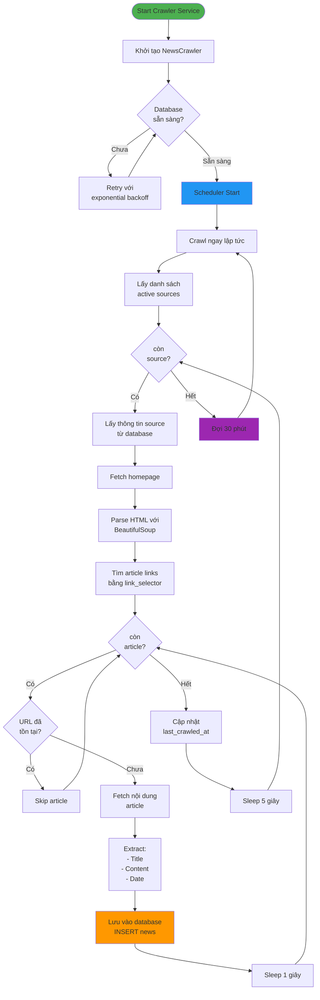
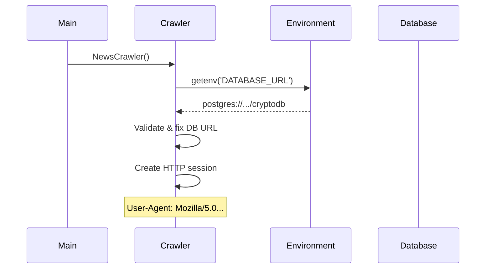
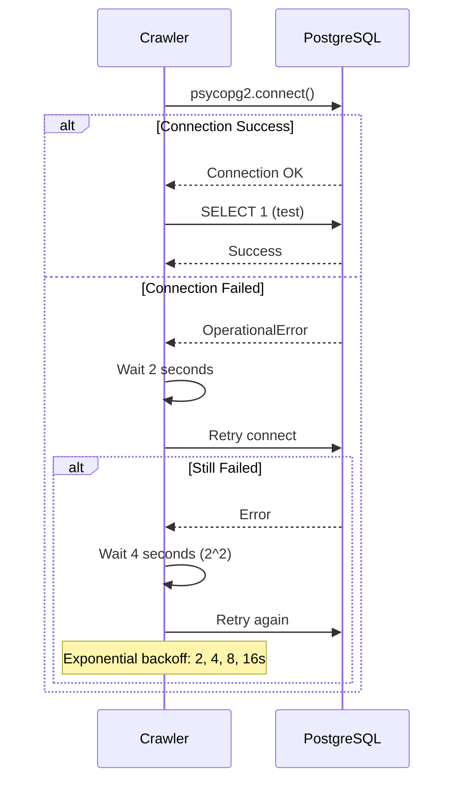
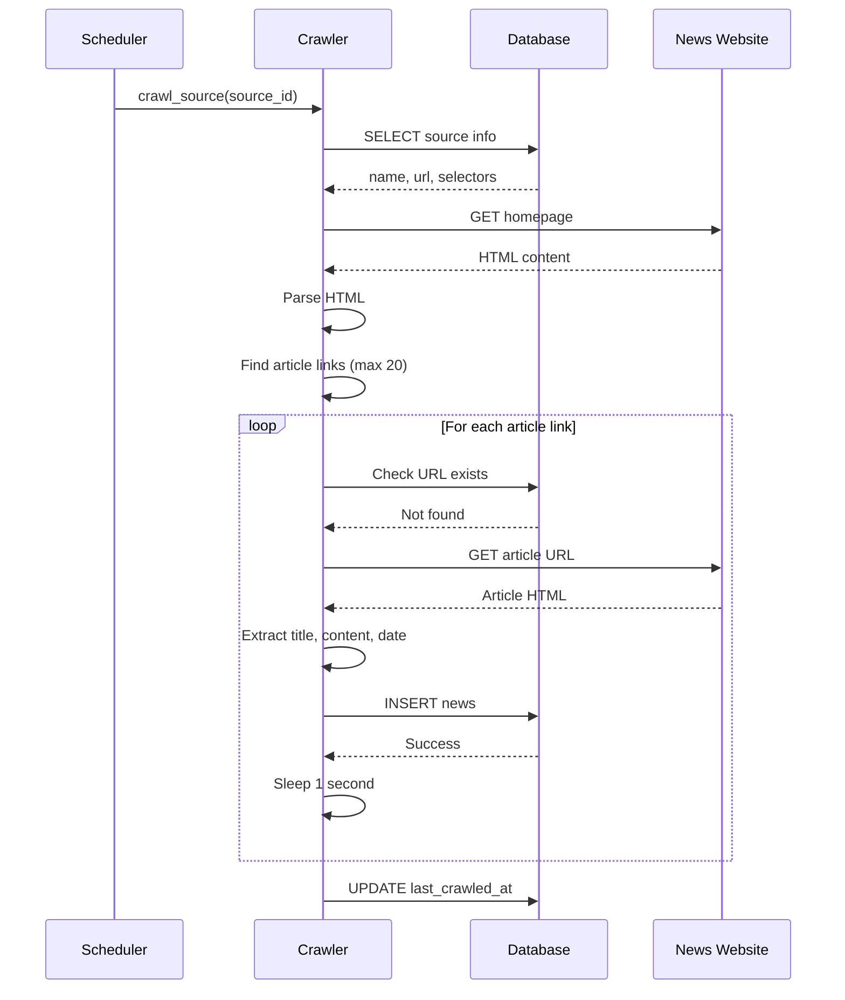
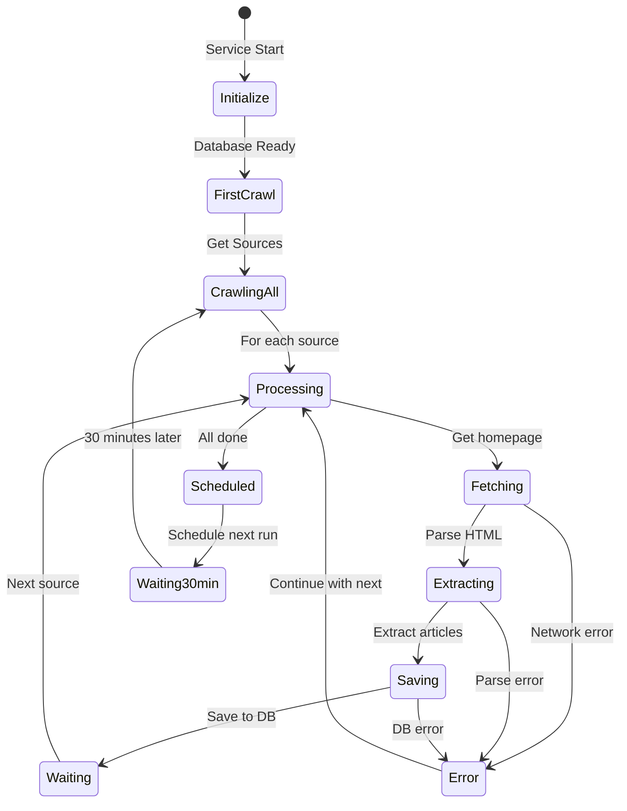

# Luồng hoạt động Crawler - Sơ đồ chi tiết

## 🔄 Luồng tổng quan



## 📋 Quy trình chi tiết từng bước

### 1. Khởi tạo Service



### 2. Kết nối Database với Retry



### 3. Crawl một Source



### 4. Scheduler Cycle



## 🎯 Các điểm then chốt

### 1. Retry Mechanism

```
Attempt 1: ──────────────> [Fail] ──┐
                                    │
Attempt 2: ────wait 2s────> [Fail] ─┤
                                    │
Attempt 3: ────wait 4s────> [Fail] ─┤ Exponential
                                    │ Backoff
Attempt 4: ────wait 8s────> [Fail] ─┤
                                    │
Attempt 5: ────wait 16s───> [Success] ✅
```

### 2. Duplicate Prevention Flow

```
Article URL
    │
    ▼
Check Database: SELECT id FROM news WHERE url = ?
    │
    ├───[Exists]───> Skip ❌
    │
    └───[Not Found]───> Fetch & Save ✅
```

### 3. Rate Limiting

```
Source 1: [Article 1] ──1s──> [Article 2] ──1s──> [Article 3]
    │
    └───5s───> Source 2: [Article 1] ──1s──> [Article 2]
                    │
                    └───5s───> Source 3: ...
```

## 📊 Dữ liệu flow

```
┌─────────────────────────────────────────────────────────────┐
│                    News Source (Database)                    │
│  id, name, url, title_selector, content_selector, ...       │
└──────────────────────┬──────────────────────────────────────┘
                       │
                       ▼
┌─────────────────────────────────────────────────────────────┐
│                    Homepage HTML                             │
│  <html>                                                      │
│    <a href="/article1">Title 1</a>                          │
│    <a href="/article2">Title 2</a>                          │
│  </html>                                                     │
└──────────────────────┬──────────────────────────────────────┘
                       │
                       ▼
┌─────────────────────────────────────────────────────────────┐
│                Extracted Article Links                       │
│  [                                                           │
│    {url: ".../article1", title: "Title 1"},                 │
│    {url: ".../article2", title: "Title 2"}                  │
│  ]                                                           │
└──────────────────────┬──────────────────────────────────────┘
                       │
                       ▼ (For each article)
┌─────────────────────────────────────────────────────────────┐
│                  Article HTML                                │
│  <h1>Article Title</h1>                                     │
│  <div class="content">Article content...</div>              │
│  <time>2025-11-25</time>                                    │
└──────────────────────┬──────────────────────────────────────┘
                       │
                       ▼
┌─────────────────────────────────────────────────────────────┐
│              Extracted Data                                  │
│  {                                                            │
│    title: "Article Title",                                   │
│    content: "Article content...",                            │
│    url: ".../article1",                                      │
│    published_at: "2025-11-25 10:00:00"                      │
│  }                                                            │
└──────────────────────┬──────────────────────────────────────┘
                       │
                       ▼
┌─────────────────────────────────────────────────────────────┐
│                    News Table (Database)                     │
│  INSERT INTO news (...) VALUES (...)                        │
└─────────────────────────────────────────────────────────────┘
```

## ⏱️ Timeline thực tế

```
00:00 ──────── Start crawler service
00:01 ──────── Database connected
00:02 ──────── Start first crawl
00:03 ──────── Crawling Source 1 (CoinTelegraph)
00:05 ──────── Found 20 articles
00:06 ──────── Processing article 1/20
00:07 ──────── Processing article 2/20
      ...
00:25 ──────── Finished Source 1 (20 articles)
00:30 ──────── Start Source 2 (CoinDesk)
00:32 ──────── Processing articles...
00:50 ──────── Finished all sources
30:00 ──────── Next scheduled crawl (30 minutes later)
```

## 🛡️ Error Handling Strategy

```
┌─────────────────┐
│   Try Action    │
└────────┬────────┘
         │
         ▼
    ┌─────────┐
    │ Success?│
    └────┬────┘
         │
    ┌────┴────┐
    │         │
   Yes       No
    │         │
    ▼         ▼
  Continue  Log Error
    │         │
    │         ▼
    │    Continue Next
    │    (Don't crash)
    │
    ▼
  Next Step
```

## 💡 Best Practices được áp dụng

1. ✅ **Exponential Backoff** - Tránh spam khi retry
2. ✅ **Rate Limiting** - Lịch sự với server
3. ✅ **Transaction Safety** - Rollback khi lỗi
4. ✅ **Duplicate Prevention** - Check trước khi insert
5. ✅ **Error Isolation** - Một article lỗi không ảnh hưởng toàn bộ
6. ✅ **Resource Cleanup** - Luôn close connection
7. ✅ **Timeout Protection** - 30s timeout cho HTTP requests


